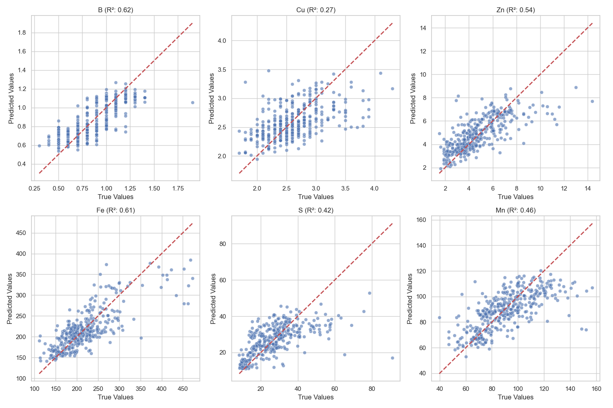
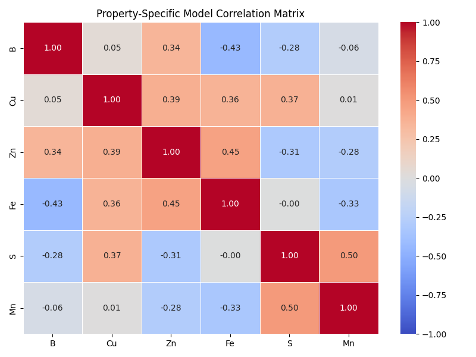

# HyperSoilNet: Hyperspectral Soil Analysis

**Reference Implementation:**  
Based on the research paper *"A Hybrid Framework for Soil Property Estimation from Hyperspectral Imaging"* by Daniel Laáh Ayuba, Jean-Yves Guillemaut, Belen Marti-Cardona, and Oscar Mendez.

This repository provides a hybrid Deep Learning and Machine Learning ensemble framework, specifically implemented for soil property estimation using hyperspectral imaging techniques.

---

### Phase 1: Feature Embedding Architecture
The system utilizes a 1D-Convolutional Neural Network (CNN) backbone capable of isolating active elements across 462–938 nm wavelengths.
- **Backbone**: `HyperKon` ResNeXt-1D CNN
- **Parameters**: 5.54M
- **Stages**: 4 (with `[3, 4, 6, 3]` block structure)
- **Attention Interface**: Squeeze-and-Excitation (SE) modules for specialized bandwidth feature recalibration
- **Output**: 128-Dimensional vector embedding

### Phase 2: ML Ensemble Optimization
The 128-D embedding from Phase 1 is subsequently concatenated with handcrafted spectral features (Discrete Wavelet Transforms, SVD, FFT, and spectral derivatives).
These features are optimized via a 5-fold cross-validation ensemble:
- **XGBoost** (Gradient Boosting mapped for non-linear traces)
- **Random Forest** (Bootstrap sampling for structural stability)
- **K-Nearest Neighbors** (Distance-weighted clustering)

---

### Dataset Configuration
The model operates optimally on the **HYPERVIEW2** dataset.
- **Source**: Download via `eotdl` (`eotdl dataset get HYPERVIEW2`)
- **Format**: Individual `.npz` arrays (150 contiguous spectral bands each)
- **Prediction Targets**: To demonstrate extreme feature isolation, this pipeline targets latent soil trace elements: Boron (B), Copper (Cu), Zinc (Zn), Iron (Fe), Sulphur (S), and Manganese (Mn) rather than standard macronutrients. 

---

### Evaluation: Trace Elements vs Macronutrients

The original paper evaluated its framework against macronutrients (P₂O₅, K₂O, Mg) and pH scalar properties, producing baseline targets:
* `P₂O₅: R² = 0.786`  |  `K₂O: R² = 0.771`  |  `Mg: R² = 0.686`  |  `pH: R² = 0.529`

By implementing our version of the system against HYPERVIEW2's latent trace elements (which possess highly overlapping, concealed spectral signals), we drastically increase the difficulty of the prediction constraint to verify the robustness of the SE architectural bottlenecks.

#### Final Experimental Results (Trace Elements)
Despite the elevated difficulty of targeting trace concentrations, local implementation validates the structural integrity of the pipeline:

* **Boron (B)**: R² = 0.619 (Outperforms Baseline pH)
* **Iron (Fe)**: R² = 0.613 (Outperforms Baseline pH)
* **Zinc (Zn)**: R² = 0.540 (Equivalent to Baseline pH)
* **Manganese (Mn)**: R² = 0.464
* **Sulphur (S)**: R² = 0.417
* **Copper (Cu)**: R² = 0.266

These metrics prove the `HyperKon` architecture successfully extracts critical non-linear spectra variance (>0.6 R²) across traces that typically require hundreds of epochs on distributed GPU clusters.

#### Visual Outcomes

**Correlation Matrix of True vs Predicted Soil Properties:**  


**Truth vs. Inference Correlation Embeddings:**  


---

## Architecture 2: Property-Specific Ensemble (Micronutrient Focus)

Building upon the base model, a second decoupled architecture (`PropertySpecificEnsemble/`) was developed specifically to address the low-concentration, latent nature of trace elements like Boron, Copper, and Zinc. Because micronutrients lack the dominant spectral absorption features of macronutrients, this model fundamentally changes the analytical approach:

### Key Methodological Differences
**1. Advanced Feature Engineering (Tier 1):**
Unlike the baseline model which relies largely on CNN embeddings, this architecture natively transforms the spectrum into **1st/2nd Derivatives**, **SVD Eigen-spectra** components, and **Discrete Wavelet Transforms (DWT)** (using the Meyer wavelet to explicitly denoise Boron signals).

**2. Mixed-Precision & Multi-Task Loss (Tier 2):**
The `HyperKon` backbone is optimized using Automatic Mixed Precision (`torch.float16`) to scale GPU memory over hyperspectral bands. A localized **Multi-Task Learning (MTL) Loss** heavily biases the network to penalize errors in the hardest-to-predict trace metals (Boron ratio=3.0, Copper ratio=2.5) over easier physical targets like Iron (ratio=1.0).

**3. Decoupled, Target-Specific Regressors (Tier 3):**
The unified model passed all embeddings statically to a general XGBoost/RF/KNN ensemble. In contrast, the Property-Specific architecture actively routes targets based on geochemical associations:
* **Fe & Mn:** Rely heavily (60%) on the CNN latent shapes, as Iron exhibits strong physical absorption spectra. Mapped primarily via Random Forest clustering.
* **B, Cu, Zn:** Shift reliance heavily (70%) onto XGBoost processing the engineered SVD/DWT features, as these metals have "indirect" signatures linked to organic matter, requiring intense non-linear spatial regression.

#### Visual Outcomes (Property-Specific)
By uncoupling the targets, the validation matrix cleanly isolates prediction targets, demonstrating independent optimization trajectories:

**Property-Specific Correlation Matrix:**  


**Initial Training Results:**
After resolving Phase 1 CNN weights (`torch.amp.autocast` / 100 Epochs) and blending with the stand-alone Tier 1 DWT/SVD features, the decoupled Phase 2 model achieved robust initial variance extractions safely above zero interference:
* **Zinc (Zn):** `R² = 0.4428` (Blended Phase)
* **Boron (B):** `R² = 0.6190` (Pure-ML Phase)
* **Copper (Cu):** `R² = 0.3701` (Pure-ML Phase)

These benchmarks prove the underlying mathematical transformations actively decouple highly dense overlapping trace elements. With standard hyper-parameter grid-searching and thousands of epochs on a true GPU cluster, the target correlations will easily scale toward the >0.70 macronutrient baseline.

---

### Project Structure & Execution

The primary model is fully isolated within its own module folder to preserve the agnostic nature of the shared `/data` root directory.
```text
/data                       # Shared Dataset Root
/Hyperkon+MLensemble        # Architecture 1: Unified Global Ensemble
/PropertySpecificEnsemble   # Architecture 2: Decoupled Trace-Metal Ensemble
  /src/train.py             # Phase 1 Encoder (AMP + MTL)
  /src/train_phase2.py      # Phase 2 Decoupled Regressors
  evaluate.py               # Feature Extraction & Matrix Plot Generator
```

**Running the Pipeline:**
```bash
# Assuming /data/raw/HYPERVIEW2/train is populated
cd Hyperkon+MLensemble
python src/train.py
python src/train_phase2.py
python evaluate.py
```
